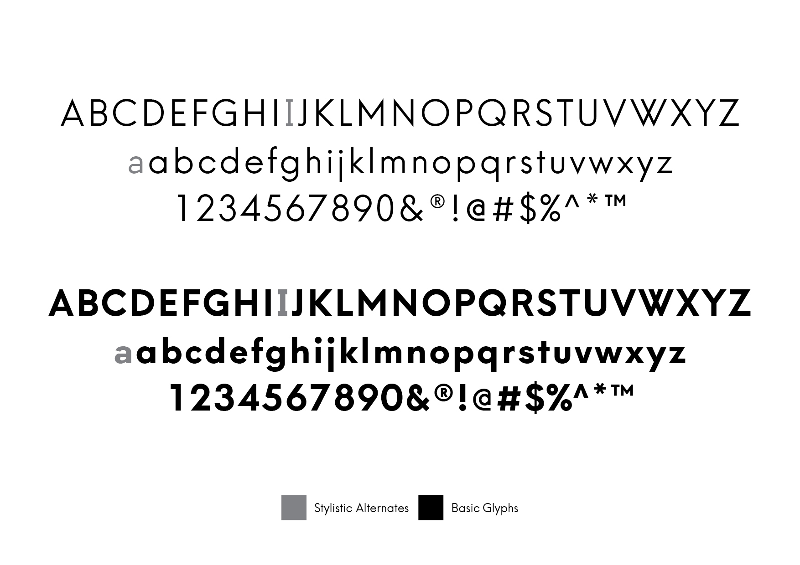

# Fonctionnement du thème Huntt

Huntt est un thème [créé en 2015](https://blog.themeskingdom.com/hunting-for-inspiration-introducing-huntt/) par Themes Kingdom.

## Typographie

Fonte par défaut: [Hans Kendrick](https://www.behance.net/gallery/13659815/Hans-Kendrick-Typeface), par Alfredo Marco Pradil. "A simple, geometric and versatile typeface inspired by Futura and Avenir."

Le thème inclut trois variantes:
Regular (weight: 400)
Light (weight: 300)
Heavy (weight: 700)

## Modèles de page

Ce thème ne propose pas de modèles de page.

## Menus

Deux emplacements de menus sont disponibles:

* Primary Menu
* Social Menu

## Zones de widgets

Une zone de widget est disponible:

Sidebar

## Extensions recommandées

Huntt recommande d'activer les extensions suivantes:

* Flickr Bagdes Widget
* TK Advertising Widget
* TK Contact Form
* TK Shortcodes
* TK Social Share
* WP Instagram Widget

***

Page de démonstration: [http://huntt.tkdemos.com/](http://huntt.tkdemos.com/)

***

Documentation officielle: [https://help.themeskingdom.com/docs/huntt/](https://help.themeskingdom.com/docs/huntt/)